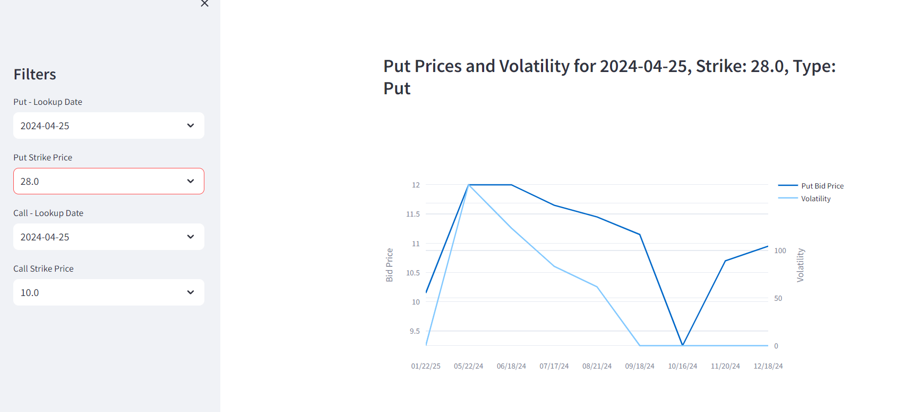

# Goal

This is a simple project intended to retrieve stock-market data from a website and displaying it using a basic dashboard.

# Installation
This project runs in Python and needs the following modules

requests
pytz
pandas
streamlit
plotly

You can install them using pip install. E.g., pip install requests

This project includes two main scripts. "web_scraping.py" should run first so the database is downloaded. With the new generated file on the directory, "app.py" generates a dashboard using streamlit in python.

1. "web_scraping.py" this script goes to the website, retrieves the database, and generates the files in csv format.
2. "app.py" this generates a dashboard that can be rendered on the browser

# Screenshots

